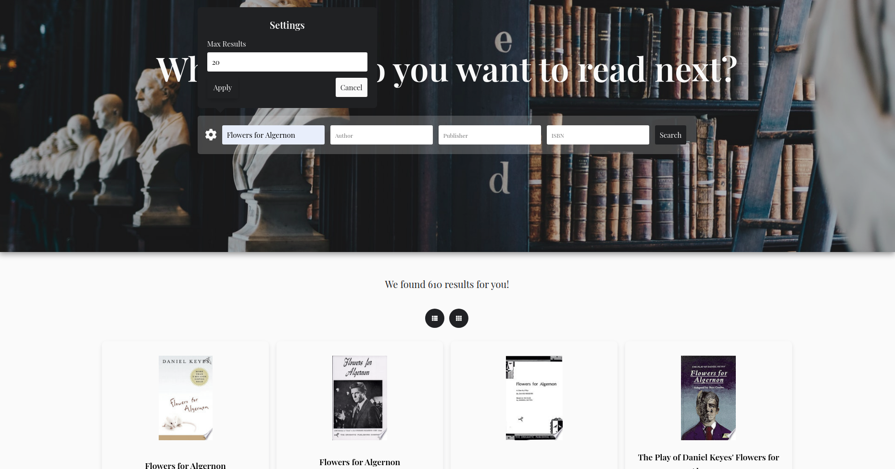
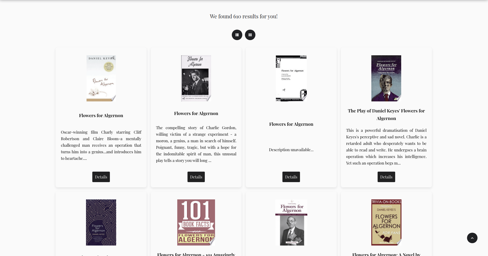

## Search books 

Single page application created by React.

## Description

The project is designed to demonstrate knowledge and practical skills about JavaScript framework React, React state management with Context API and React hook useReducer, collaborate with Google Books APIs using Axios, testing application with Jest.

### Demo

  https://unruffled-thompson-0eac1d.netlify.app/

#### Screenshots of the app

### Technologies

#### Frontend 

- React
- Axios
- Jest

#### Backend

- Google Books APIs

### Features

- Search for books in the Google Books library
- Search for a book by author, ISBN, publisher
- Set the number of books for one request
- Customize book display styles on the client
- Downloading new books by scrolling the page

## Getting started

  App requires to have node (4.x.x) and npm (2.x.x) installed.

#### Start with installing the dependencies:

  Run `npm install` to install all required packages.

#### Running:

  Use `npm run dev` to start the dev server.
