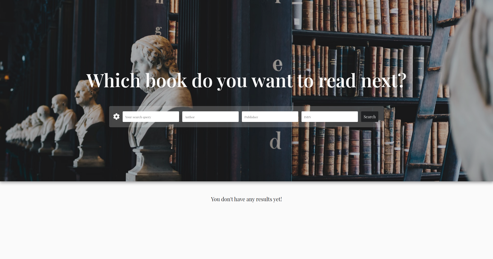

## Search books 

> Single page application

### Demo

  https://unruffled-thompson-0eac1d.netlify.app/

#### Screenshots of the app

### Technologies

- [React](https://reactjs.org/) | A JavaScript library for building user interfaces

## Getting started

  App requires to have node (4.x.x) and npm (2.x.x) installed.

#### Start with installing the dependencies:

  Run `npm install` to install all required packages.

#### Running:

  Use `npm run dev` to start the dev server.

